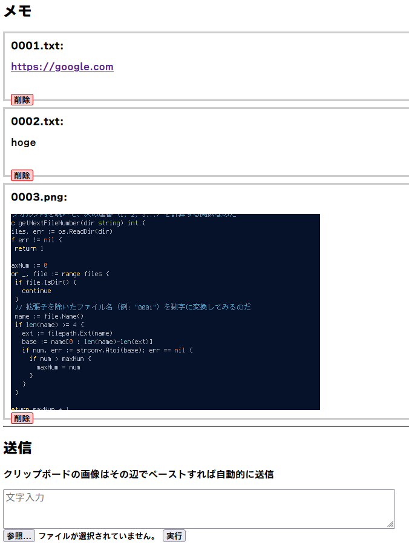

# ペタ!

## これは何？

テキストや画像をペタペタ貼っていく Web アプリ。

Line の keep メモみたいなものをイメージして作成。



## できること、できないこと

- お一人様専用
  - 複数人で共通で使いたい → みんなでアクセスする
  - 複数人が別々に使いたい → 必要な数だけサービスを走らせる。
- 認証なし
  - Cloudflare のトンネルで公開アプリとすれば Cloudflare 認証、メール OTP 認証など、いろい
    ろ設定できる。
  - Basic 認証なら実現できたけど、Wabauthn (Passkey) なんかには力が足りなかった。
  - Basic 認証は平文でパスワードを送り付ける認証なので、Cloudflare の公開アプリへの認証の
    方が強固と判断した。
  - Cloudflare さえ信頼できないような情報を、このアプリで扱うとも思えなかった。
- タグとかグループとか、振り分け機能なし
  - 必要な分だけポートを変えてサービスを走らせる。
- ださい
  - センスの無い人間がスタイルシートとか弄っても碌なことにならないから自分では触りません。

## ビルド

### コンパイル済バイナリを利用

[リリース版](https://github.com/Nobutarou/Peta/releases)

### 自分でビルド

Go は必要です。

```zsh
make
```

で ``src/peta`` が出来ます。単独で動くので好きな場所にコピーしてください。

## 使い方

### 初回

```zsh
peta
```

デフォルトでは 8080ポートでサービスが立ち上がります。
アップロードしたファイルは ``peta`` 実行フォルダの ``./uploads`` です。

また、それらを記した ``config.json`` を出力します。

そのままで良ければ、別に本番の節は無視して大丈夫です。

### 本番

``config.json`` のポートと保存フォルダを好みで変更します。
``peta`` と同じフォルダにある ``config.json`` を読みこむので、もう一度

``zsh
peta
``

を実行します。
